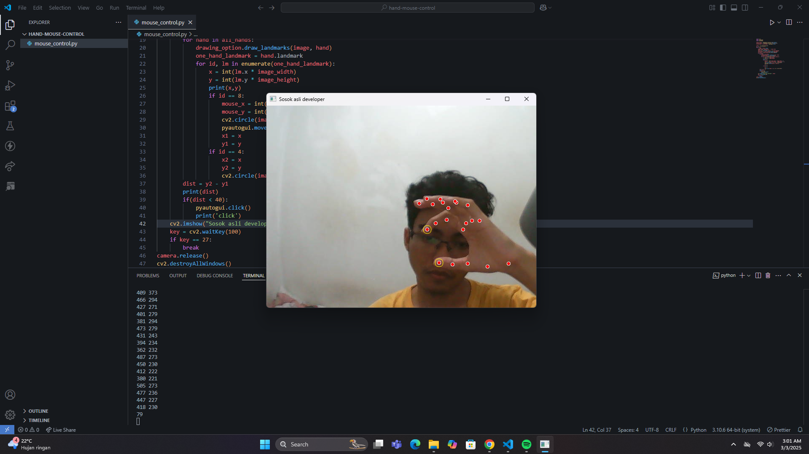

# Hand Tracking Mouse menggunakan Python

<p align="center">
  
</p>

## Deskripsi
Proyek ini merupakan implementasi sistem mouse virtual yang dikendalikan menggunakan gerakan tangan. Dengan memanfaatkan **MediaPipe** untuk pelacakan tangan dan **OpenCV** untuk pemrosesan gambar, proyek ini memungkinkan pengguna mengontrol kursor hanya dengan gerakan tangan mereka.

## Fitur
- Deteksi tangan secara real-time menggunakan **MediaPipe Hands**
- Kontrol kursor menggunakan koordinat tangan

## Prasyarat
Sebelum menjalankan proyek ini, pastikan Anda telah menginstal pustaka berikut:
```bash
pip install opencv-python mediapipe pyautogui
```

## Cara Menjalankan
1. Clone repositori ini:
   ```bash
   git clone https://github.com/username/hand-tracking-mouse.git
   ```
2. Masuk ke direktori proyek:
   ```bash
   cd hand-tracking-mouse
   ```
3. Jalankan skrip utama:
   ```bash
   python hand_tracking_mouse.py
   ```

## Teknologi yang Digunakan
- **Python**
- **OpenCV**
- **MediaPipe**
- **PyAutoGUI**

## Kontributor
- [AdrianIchiro](https://github.com/AdrianIchiro)

## Lisensi
License [MIT License](LICENSE).
